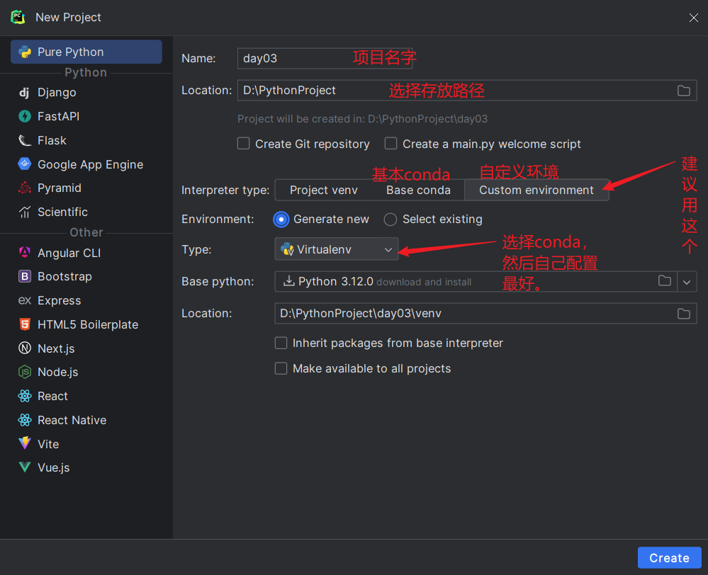
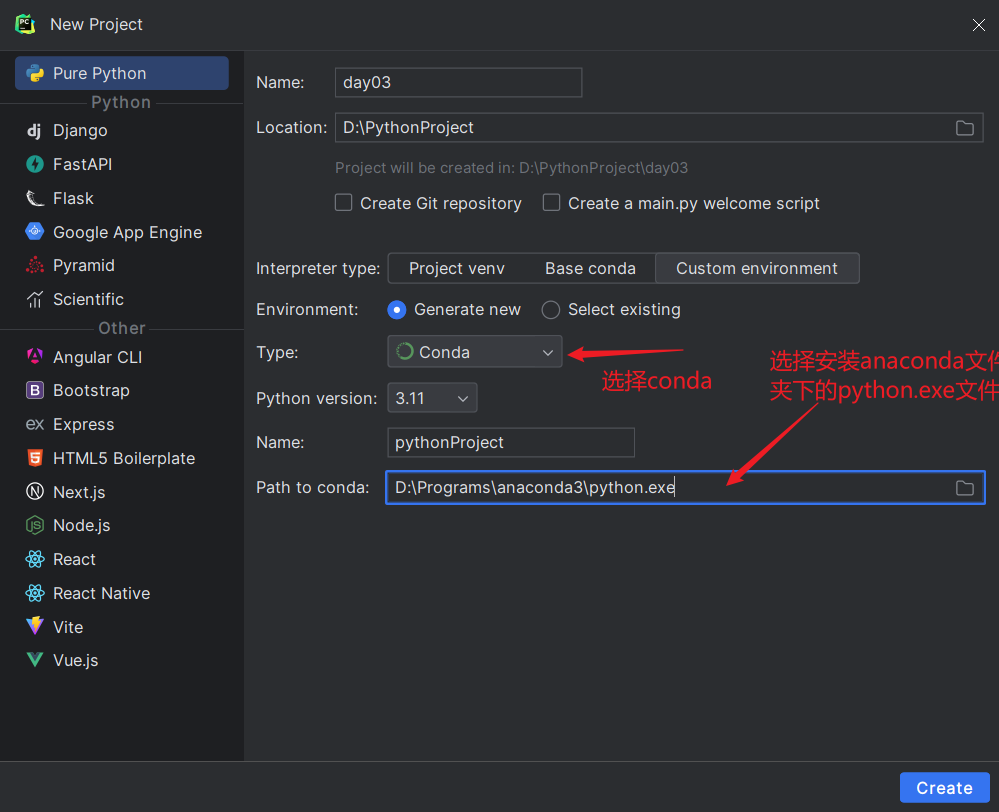
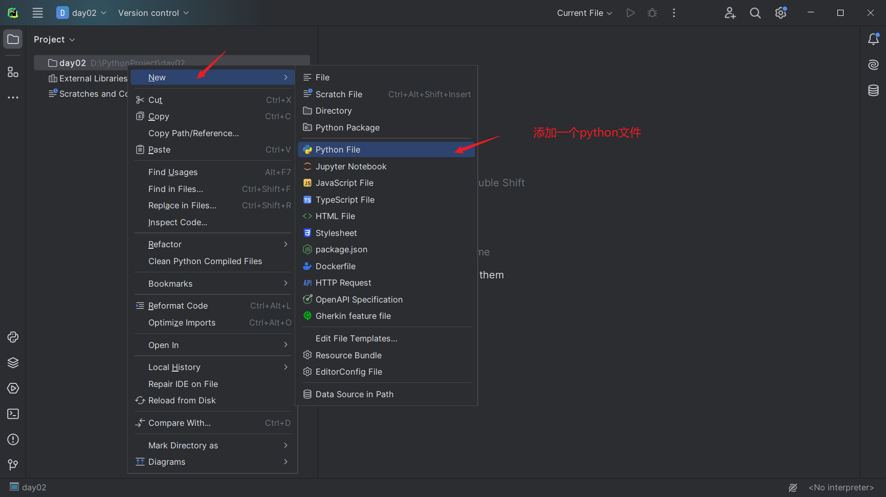
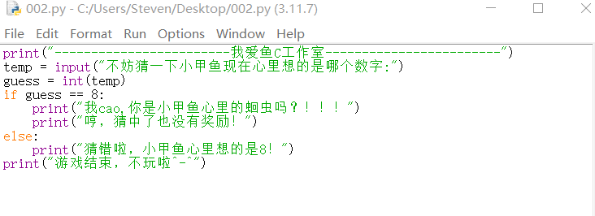
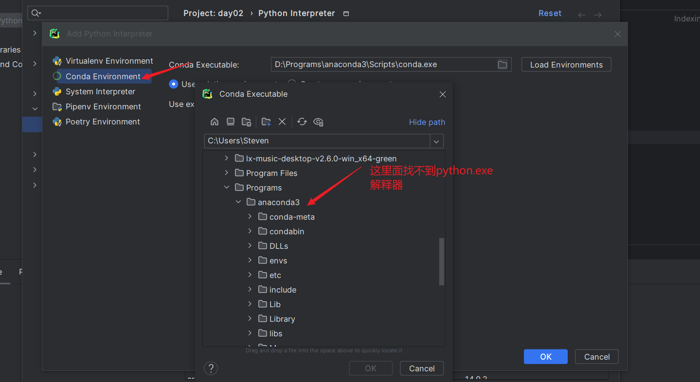

## python简介

脚本语言(Scripting language)是电脑编程语言，因此也能让开发者藉以编写出让电脑听命行事的程序。以简单的方式快速完成某些复杂的事情通常是创造脚本语言的重要原则，基于这项原则，使得脚本语言通常比 C语言、C++语言 或 Java 之类的系统编程语言要简单容易。

也让脚本语言另有一些属于脚本语言的特性：

- 语法和结构通常比较简单
- 学习和使用通常比较简单
- 通常以容易修改程序的“解释”作为运行方式，而不需要“编译”
- 程序的开发产能优于运行性能


一个脚本可以使得本来要用键盘进行的相互式操作自动化。一个Shell脚本主要由原本需要在命令行输入的命令组成，或在一个文本编辑器中，用户可以使用脚本来把一些常用的操作组合成一组串行。主要用来书写这种脚本的语言叫做脚本语言。很多脚本语言实际上已经超过简单的用户命令串行的指令，还可以编写更复杂的程序。

## anaconda简介

1. 一般我们可以直接安装python，但要进行数据分析还是可以使用anaconda更方便。anaconda会自带python，故无需再安装python。

2. Anaconda，中文大蟒蛇，是一个开源的Anaconda是专注于数据分析的Python发行版本，包含了conda、Python等190多个科学包及其依赖项。

3. Anaconda就是可以便捷获取包且对包能够进行管理，包括了python和很多常见的软件库和一个包管理器conda。常见的科学计算类的库都包含在里面了，使得安装比常规python安装要容易，同时对环境可以统一管理的发行版本

## IDLE

使用python自带IDLE编写代码


shell是解释器，例如windows的cmd，linux的shell，写一行执行一行。


有时也可以不用print( )，直接输出。


“+”是一个连接符


最后一个报错是因为“  ”里是字符串，而8没打引号时是个整型，故不能相加，而*8相当于print8次。

用" print "输出，和不用" print "输出区别


没有"print"输出字符串会有 '  '或 "  "，这其实是直接输入是将**结果及类型**打印到屏幕上（python字符串类型用 "  " or '  ' 表示出来，因为只有字符串带引号）

而用"print"输出是将结果打印到屏幕上

2. 在安装anaconda中使用python的IDLE

   

   打开Anaconda Powershell Prompt 在命令行里输入idle就行

   

   可以看到直接打开了IDLE
   

   当然也可以直接在win+r中输入cmd，打开windows的shell输入IDLE打开IDLE

   

## Pycharm新建项目





点击create就行，python版本（python version）是anaconda自带的不用修改



## BIF内置函数

python中有很多BIF——Built-in functions(内置函数)，eg：print，str都是BIF

查看python中BIF

```python
dir(__builtins__) //"__"是两个下划线 _ _
```


小写的就是BIF，可以用查看其用法

```python
help( )     //( )里填如相应的BIF名字
```


如果看不懂就可以直接百度看，也可以查看。

## 变量

### 变量

- 变量名就像我们现实社会的名字，把一个值赋值给一个名字时，Ta会存储在内存中，称之为变量（variable），在大多数语言中，都把这种行为称为“给变量赋值”或“把值存储在变量中”。

- 不过Python与大多数其他计算机语言的做法稍有不同，Ta并不是把值存储在变量中，而更像是把名字贴在值的上边。

- 所以有些Python程序员会说“Python”没有“变量”，只有“名字”。

  ```python
  teacher = '小甲鱼'      //开辟一个空间存放小甲鱼，然后给他一个名字叫teacher
  print(teacher)         //print输出字符串要加" "，输出变量不加
  //输出结果:小甲鱼
  ```

  ```python
  teacher = '老甲鱼'
  print(teacher)
  //输出结果:老甲鱼
  ```

  ```python
  first = 3
  second = 8
  third = first + second
  print(third)
  //输出结果:11
  ```

  ```python
  myteacher = '小甲鱼'
  yourteacher = '黑夜'
  ourteacher = myteacher + yourteacher  //字符串拼接
  print(ourteacher)
  //输出结果:小甲鱼黑夜
  ```

  **注意**

  1. 在使用变量之前，需要对其先赋值。

  2. **变量名可以包括字母、数字、下划线，但变量名不能以数字开头。**

  3. python区分大小写，故字母可以是大写或小写，但大小写是不同的。也就是说fishc和FishC对于Python来说是完全不同的两个名字

  3. BIF中已经用过的函数名，尽量不用做变量名  eg：print，str

  4. 等号（=）是赋值的意思，左边是名字，右边是值，不可写反咯。

  5. 变量的命名理论可以取任何合法的名字，但作为一个优秀的程序员，请将尽量给变量取一个专业一点儿的名字
  
     ```python
     t =‘小甲鱼’       //×
     xxoo =‘小甲鱼’    //×
     teacher =‘小甲鱼’ //√
     ```
  

## 字符串

1. 我们所认知的字符串就是引号内的一切东西，我们也把字符串叫做文本，文本和数字是截然不同的，咱看例子：

   ```python
   5+8     //数字5+8
   //输出  13
   ’5’+’8’ //5和8字符进行拼接
   //输出  '58'		//带引号是因为直接输出
   print('5' + '8')
   //输出 58			//不带印好是因为用print输出
   ```

   要告诉Python你在创建一个字符串，就要在字符两边加上引号，可以是单引号或者双引号。但必须成对，你不能一边单引号，另一边却用上双引号结尾。


2. 如果字符串中需要出现单引号或双引号怎么办？

   eg：我想打印字符串：Let’s go!，中间有一个 ' 单引号

   ```python
   //有两种方法
   //第一种比较常用，就是使用我们的转义符号（\）对字符串中的引号进行转义：
   print(‘Let\’s go!’)
   //第二种因为里面有单引号's,所以外面用"  "双引号就可以避免。
   print（"Let's go!")
   ```

3. 好像反斜杠是一个好东西，但不妨试试打印：

   string = '  C:\now  '

   ```python
   string = 'C:\\now       // '\n'是换行符，故多填一个\反斜杠
   print(string)		
   ```

4. 但如果对于一个字符串中有很多个反斜杠：

   string = '  C:\Program Files\Intel\WiFi\Help  '

   只需要在字符串前边加一个英文字母r即可：

   ```python
   string = r'C:\Program Files\Intel\WiFi\Help'
   print(string)
   ```

   但要string = '  C:\Program Files\Intel\WiFi\Help\  '，以反斜杠（\）结尾时会报错

   

   ```python
   这种情况用字符串拼接是最好的。
   string = r'C:\Program Files\FishC\Good' + '\\'
   ```

   注意这里使用string，而不是str是因为BIF里一个函数名为str，尽量不要用否则使用str函数时会出错。

### 长字符串

如果希望得到一个跨越多行的字符串，

例如：

```
我爱鱼C，
正如我爱小甲鱼，
他那呱唧呱唧
呱唧呱唧
呱唧呱唧的声音，
总缠绕于我的脑海，
久久不肯散去……
```

这我们就需要使用到三重引号字符串！

```
str = """我爱鱼C，
正如我爱小甲鱼，
他那呱唧呱唧
呱唧呱唧
呱唧呱唧的声音，
总缠绕于我的脑海，
久久不肯散去……"""
```


可以在不用print中看出三重引号会在换行时添加 \n

当然不用长字符串也行

```python
print("我爱鱼C，")
print("正如我爱小甲鱼，")
print("他那呱唧呱唧")
print("呱唧呱唧")
print("呱唧呱唧的声音，")
print("总缠绕于我的脑海，")
print("久久不肯散去……")
```

python多个输出之间会自动换行，不像C语言一样printf不会换行输出，要换行只能加 " \n "

或

```
str = '我爱鱼C，\n正如我爱小甲鱼，\n他那呱唧呱唧\n呱唧呱唧\n呱唧呱唧的声音，\n总缠绕于我的脑海，\n久久不肯散去……'
```

## 数据类型

1. 整型

   python整型一般没有内存空间控制，任意大小，故可以进行任意大数运算。

2. 浮点型

   就是小数，也没有内存空间控制

3. 布尔类型

   True  、False

   True相当于1

   False相当于0

   故还可以进行计算，但最好不用

   

4. e记法（本质上还是浮点类型）

   即科学计数法2.5×10^27

   python中为2.5e27 或者 2.5E27

   有时后也为2.5e+27，2.5e-27，即指数上会有正负号

   

   **查看数据类型**

   1. 使用type函数

      ```python
      print(type(10))
      print(type(10.99))
      print(type(True))
      print(type(5e15))
      print(type("哈哈哈哈哈"))
      ```

      打印出来的值
   
      ```python
      <class 'int'>
      <class 'float'>
      <class 'bool'>
      <class 'float'>
      <class 'str'>
      ```

   2.使用isinstance判断a是否为b类型，返回值为bool布尔类型

   isinstance(a, 类型)

   ```python
   print(isinstance(10, int))
   print(isinstance(10.99, float))
   print(isinstance(True, bool))
   print(isinstance(5e15, int))
   print(isinstance("哈哈哈哈哈", str))
   ```
   
   返回
   
   ```python
   True
   True
   True
   False		//5e15是浮点型
   True
   ```
   
   
   
   ## 数据类型转换
   
   
   
   
   
   ```python
   a = '哈哈哈'
   b = int(a)//这里会报错，因为'哈哈哈'这个字符串不是数字类型的字符串
   ```
   

## 运算符

### 算术运算符

```python
+ - * / // % **
```

```python
a = 5
a = a + 5
a += 3  # 相当于a = a + 3
print(a)
b = 3
b -= 1  # 相当于 a = a - 1
print(b)
a = b = c = d = e = f = g = 10
a += 1
b -= 3
c *= 10
d /= 8  # 不再像C语言一样整数除法为小数然后舍去小数部分，python是直接把结果转为正常除法得到小数。
e //= 8  # 这个就像C语言一样的除法，舍弃小数。学术名字叫地板除法。
f %= 8  # 正常取余运算
g **= 2  # 幂运算，即g^2 —— g的2次方，g = g ** 2
print('a = ' + str(a))
print('b = ' + str(b))
print('c = ' + str(c))
print('d = ' + str(d))
print('e = ' + str(e))
print('f = ' + str(f))
print('g = ' + str(g))
```
输出结果：
```python
13
2
a = 11
b = 7
c = 100
d = 1.25
e = 1
f = 2
g = 100
```

### 运算优先级

|                 运算符                 |                        描述                        |
| :------------------------------------: | :------------------------------------------------: |
|                   **                   |                幂运算（最高优先级）                |
|                ~、+、-                 | 按位翻转，一元加号和减号（最后两个叫做正号和负号） |
|              *、/、%、//               |              乘、正常除、取模和取整除              |
|                  +、-                  |       加法、减法（真正的加减法而不是正负号）       |
|                 >>、<<                 |                  右移、左移运算符                  |
|                   &                    |                       按位与                       |
|                 ^、\|                  |                      位运算符                      |
|              <=、<、>、>=              |                     比较运算符                     |
|               <>、==、!=               |                     等于运算符                     |
| = 、%=、 /=、 //=、 -=、 +=、 *=、 **= |                     赋值运算符                     |
|               is、is not               |                     身份运算符                     |
|               in、in not               |                     成员运算符                     |
|              not、or、and              |                     逻辑运算符                     |

同一优先级先左后右执行

但一般记住最好写一个算式就打一个括号以免弄混

```python
-3 ** 2		# 结果为-9，-(3^2)，** 优先级最高
(-3) ** 2	#结果为9,(-3)^2
```

### 比较操作符

| **Python** **的比较操作符** |                  |
| --------------------------- | ---------------- |
| >                           | 左边大于右边     |
| >=                          | 左边大于等于右边 |
| <                           | 左边小于右边     |
| <=                          | 左边小于等于右边 |
| ==                          | 左边等于右边     |
| !=                          | 左边不等于右边   |

```
1 < 3
输出：True
1 > 3
输出：False
```

### 逻辑运算符

| 逻辑运算符 | 功能                       |
| ---------- | -------------------------- |
| and        | 与运算相当于C语言中   &&   |
| or         | 或运算相当于C语言中   \|\| |
| not        | 非运算相当于C语言中    ！  |


### 成员运算符 in

1. 在 for 循环中，获取列表或者元组的每一项：

   ```python
   for item in list:
   	循环体
   ```

   

2. 判断左边的元素是否包含于列表，类似java中的List的contains方法

   ```python
   if 1 in aa:
     print 'Very Good'
   else:
     print 'Not Bad'
   ```

     这里是判断 1 是否在 aa 内部

3. 可以用来判断字符串是否包含某一串,可以用来筛选文件使用

   ```python
   if 'a' in 'qa':
       print 'ok'
   ```

 4. 比如判断project_admin变量是否是数字1或者字符串“1”

    ```python
    if project_admin in (1, "1")
    ```

## 分支语句

### **if - else**


注意if 和 else条件后是 ' : ' 冒号

不在IDEL的shell中直接执行，换成将代码写在文件中


往文件中输入代码



一个猜数字小游戏

```python
print("------------------------我爱鱼C工作室------------------------")
temp = input("不妨猜一下小甲鱼现在心里想的是哪个数字:")
guess = int(temp)
if guess == 8:
    print("我cao,你是小甲鱼心里的蛔虫吗？！！！")
    print("哼，猜中了也没有奖励！")
else:
    print("猜错啦，小甲鱼心里想的是8！")
print("游戏结束，不玩啦^_^")
```

- python中变量可以没有声明如temp，guess，而C语言里要    int temp, guess;   来表示。

- python中因为没有{  }来框住if 和 else 里的语句，故要用好 缩进（Tab），同一样的缩进相当于在同一个{  }中的语句，而不再同一缩进里则不属于同一个{  }中。

  例题：

  按照100分制，90分以上成绩为A，80到90为B，60到80为C，60以下为D写一个程序，当用户输入分数，自动转换为ABCD的形式打印。

  方法一：

  ```python
  # 方法一：纯if
  score = int(input('请输入一个分数：'))
  if 100 >= score >= 90:
      print('A')
  if 90 > score >= 80:
      print('B')
  if 80 > score >= 60:
      print('C')
  if 60 > score >= 0:
      print('D')
  if score < 0 or score > 100:
      print('输入错误！')
  ```
  
  方法二：
  
  ```python
  # 方法二：if - else
  score = int(input("请输入您的成绩："))  # 输入成绩
  if score >= 90:
      print("A")
  else:
      if (score < 90) and (score >= 80):
          print("B")
      else:
          if score >= 60 and score < 80:
              print("C")
          else:
              if score > 0 and score < 60:
                  print("D")
              else:
                  print("输入成绩错误")
  ```

### if - elif

方法三：

 ```python
 # 方法三：if - elif，elif相当于C语言中的else if，就不用再像方法一那样写else: 再if(条件):,太多了
 if score >= 90:
     print("A")
 elif (score < 90) and (score >= 80):
     print("B")
 elif score >= 60 and score < 80:
     print("C")
 elif score > 0 and score < 60:
     print("D")
 else:
     print("输入成绩错误")
 ```

### Python可以有效避免“悬挂else”

什么叫“悬挂else”？

我们举个例子，初学C语言的朋友可能很容易被以下代码欺骗：

```c
if ( hi > 2 )		//第一个if
 	if( hi > 7 )	//第二个if
 	printf("好棒！好棒！");
else				//这个else你看起来是对应第一个if的，但由于C语言是就近原则，这个else是对应第二个if的，除非加上大括号进行限制
 printf("切~");

//即电脑实际识别的是这样的

if ( hi > 2 ){
	if( hi > 7 )
		printf(“好棒！好棒！”);
	else
		printf(“切~”);
}
```

而python，没有大括号这种东西，靠缩进来判断代码段属于一起的，可以很好的处理上面情况

```python
if ( hi > 2 ):
	if( hi > 7 ):
		printf("好棒！好棒！");
else:	#这里else就对应第一个if，因为他们的缩进相同
	printf("切~");

```

### 三元操作符表示分支

C语言中用<表达式1> ? <表达式2> : <表达式3>;

其返回值为：先求表达式 1 的值，如果为真，则执行表达式 2，并返回表达式 2 的结果；如果表达式 1 的值为假，则执行表达式 3，并返回表达式 3 的结果。

```c
a ? (a + b) : (a - b);//若a为真（大于0），则执行a + b；若a为假（为0），则执行a - b
```

python中则用<表达式2> if <表达式1>  else <表达式3>;

```python
(a + b) if a else (a - b);#若a为真，则执行a + b；若a为假，则执行a - b
```

eg：

```python
if x < y:
	small = x
else:
	small = y
```

相当于

```python
small = x if x < y else y
```

### 断言assert

assert这个关键字我们称之为“断言”，当这个关键字后边的条件为假的时候，程序自动崩溃并抛出AssertionError的异常。
举个例子：assert 3 > 4

一般来说我们可以用Ta再程序中置入检查点，当需要确保程序中的某个条件一定为真才能让程序正常工作的话，assert关键字就非常有用了

## 循环

### While循环


注意条件不用打括号，且记得要加 : 冒号

```python
while 条件：
	循环体
```

改进小游戏

- 不要只执行一次

- 可以返回当前输入数字比心里数字是大还是小

- 猜错三次即退出，并输出正确答案

- 心里想的是一个随机数

 ```python
  import random		//导入random模块
  
  secret = random.randint(0, 10)		//每次随机想一个心里数字在0-10之内。
  temp = input("不妨猜一下小甲鱼心中的数字:")   //输入的通用式子，input()可以直接写，括号里可以放输入前先输出一段话。
  guess = int(temp) //将输入的数字强制转换为int整数类型
  i = 0
  while 1:        //条件为1，故一直循环，知道猜对或者，猜错三次退出。
      if guess == secret:
          print("哇塞，你是小甲鱼心里的蛔虫吗？!!!")
          print("哼，猜中了也没有奖励!")
          break
      else:
          if guess > secret:
              print("哥，大了大了~~")
          else:
              if guess < secret:
                  print("哥，小了小了~~")
      i = i + 1
      if i >= 3:  //超过3次尝试就跳出游戏。
          break
      temp = input("哎呀，猜错了，请重新输入吧:")
      guess = int(temp)
  
  if guess != secret and i == 3:    //当第三次输出且未猜对便输出正确答案。
      print("尝试太多次了，下次再来吧")
      print("正确答案是：" + str(secret))
  print("游戏结束，不玩啦^_^")
 ```

### for循环

主要用于获取列表或者元组的每一项

```python
for 目标 in 表达式：
	循环体
```

python的for循环特点

- 没有C语言中i++和判断退出循环条件，python会自己自动识别何时跳出循环，遍历完字符串或遍历完列表中项目时会自动退出

 eg1：打印字符串

```python
a = 'abcdefghijklmnop'  # 定义一个字符串
for i in a:
    print(i, end=' ')  # end用于打印后以什么结尾
```

eg2：打印列表

```python
member = ['小甲鱼', '小布丁', '黑夜', '迷途', '哈哈']  # 定义一个列表
for j in member:  
    print(j, len(j))  # len为当前j所代表的列表中项目的字符长度
```

### break和continue

break完全退出循环

```python
bingo = '小甲鱼是帅哥'
answer = input('请输入小甲鱼最想听的一句话：')

while True:
    if answer == bingo:
        break # 满足if中条件直接退出循环
    answer = input('抱歉，错了，请重新输入（答案正确才能退出游戏）：')

print('哎哟，帅哦~')
print('您真是小甲鱼肚子里的蛔虫啊^_^')
```

continue退出本次循环并进入下一次循环

```python
for i in range(10):
    if i % 2 != 0:
        print(i)
        continue # 若满足if中条件则退出当前循环，i指向下一个数字
    i += 2
    print(i)

```

## 列表(list)

### 概念

列表，相当于数组，但数组里面只能是同种数据类型，但列表中各元素的数据类型可以不同可以相同

```python
# 普通列表
member = ['小甲鱼', '小布丁', '哈哈', '嘻嘻', '黑夜', '迷途']  # 列表用中括号[ ]括起来
numer = [1, 2, 3, 4, 5, 6, 7, 8, 9, 10]
# 混合列表，可以存放各种数据类型，字符串，整型，浮点型，列表，对象
mix = ['小甲鱼', 1, 3.14, numer, member]
# 当不知道想往列表中存放什么数据时，可以先创建一个空列表，里面元素可以之后添加
empty = []  # 空列表
```
### 打印列表

方法1

```python
member = ['小甲鱼', '小布丁', '哈哈', '嘻嘻', '黑夜', '迷途']
for i in member: #打印一个列表
    print(i, end=' ')
```

输出：

```
小甲鱼 小布丁 哈哈 嘻嘻 黑夜 迷途
```

方法2

```python
member = ['小甲鱼', '小布丁', '哈哈', '嘻嘻', '黑夜', '迷途']
print(member)
```

输出：

```python
['小甲鱼', '小布丁', '哈哈', '嘻嘻', '黑夜', '迷途'] # 直接输出是会带类型变量类型的，列表类型就是带[ ]中括号来表示
```


### 往列表中添加元素

```python
# 往列表中添加元素
# 用（append方法）
print(len(empty))  # 最初empty长度为0
empty.append('哈哈')  # extend中只能添加一个元素
for i in empty: #打印一个列表
    print(i, end=' ')
```

```python
# 用extend方法
empty.extend(['嘻嘻', '略略'])  # extend方法能多个元素，但参数是一个列表才行
for i in empty:
    print(i, end=' ')
```

```python
# 用insert方法
# 前两个方法只能在列表末尾添加元素，而insert方法可以在任何位置添加一个或多个元素
empty.insert(0, '啊呜')  # insert方法有两个参数，第一个是插入位置，注意位置是从0开始的，第二个是插入元素
for i in empty:
    print(i, end=' ')
print('\n')
empty.insert(2, ['haha','xixi','luoluo'])  # 第二个参数可以是单个元素，也可以是一个列表
for i in empty:
    print(i, end=' ')
print('\n')
```

### 交换元素位置

```python
member = ['小甲鱼', '小布丁', '哈哈', '嘻嘻', '黑夜', '迷途', '啊呜', '略略', '林小溪']
print(member)
print(member[0])  # 列表相当于数组从0开始取数据也类似
print(member[1])

# 交换member[0]和member[1]元素位置
temp = member[0]
member[0] = member[1]
member[1] = temp
print(member)
```

### 从列表删除元素

```python
# 方法1，已知列表中某一元素并删除 remove( )方法
member.remove('小甲鱼')
print(member)

# 方法2，删除列表某一位置的元素  使用del语句
del member[1]  # del是一个语句，不是方法，member.del(1)是错的，方法才要有.()
print(member)
# del member则会删除整个列表

# 方法3，列表因为用栈存储故可以用  pop( )方法
print(member.pop())  # 栈是从栈尾开始弹出元素
print(member)
print(member.pop(1))  # 也可以弹出某一位置的元素
print(member)
```

### 列表分片（取出列表的子列表）

利用索引值，每次我们可以从列表获取一个元素，但是如果一次性需要获取多个元素，可以利用列表分片，实现这个要求。

```python
# 列表分片，取出其中一段连续的子列表，用法  列表名[startIndex:endIndex+1]
member = ['小甲鱼', '小布丁', '哈哈', '嘻嘻', '黑夜', '迷途', '啊呜', '略略', '林小溪']
print(member)
print(member[1:3])  # 输出member[1]和member[2]，因为3 - 1 = 2只输出两个元素，这也是为什么上面endIndex+1
print(member[:3])  # 前面未写则从最开始到3-1
print(member[1:])  # 后面未写则从1到最后
print(member[:])  # 前后都未写则从最开始到结尾
```

### 关于取列表的分片（子列表）拷贝到另一列表中需注意到的东西

```python
list6 = [3, 5, 2, 1, 56, 36, 7]
list7 = list6[:]  # 取出list6中的分片拷贝到另一个空间，该空间给一个名字为list7，前面学过python中变量只是给某一空间的命名而已
list8 = list6  # 这个操作相当于把list8这个名字也匹配上list6所命名的空间，故list6和list8是同一个东西，排序后列表相同
list6.sort()
print(list6)
print(list7)
print(list8)
```

结果：


图示


### 列表常用操作符

比较操作符>、<、==、<=、>=、!=，返回bool值

```python
list1 = [123]
list2 = [234]
print(list1 > list2)  # False
list1 = [123, 456]
list2 = [234, 123]
print(list1 > list2)  # False,比较操作先从两个列表的第一个元素开始比较，若不同则返回比较结果，后面的就不在进行比较
list3 = [123, 234]
print(list1 > list3)  # True，若第一个元素相同再比较两个序列的第二个元素

member1 = ['abc', 'abc']
member2 = ['acd', 'abc']
print(member1 < member2)  # 字符串列表比较大小是从字符串第一个字符的ASCII码大小开始比较
```

逻辑操作符and、or......，返回bool值

```python
print((list1 == list2) and (list1 > list3))
```

拼接操作符 + ，注意不是加法，拼接操作符两侧必须是序列才能拼接，而不能添加元素，添加元素上面学了

```python
list4 = list1 + list2
print(list4)  # 打印结果[123, 456, 234, 123]
list5 = list1 + 'hahaha'  # 这个是不行的，因为列表和元素不能拼接，会报错
```

重复操作符

```python
list3 *= 5  # 相当于list3 = list3 * 5
print(list3)  # list3重复5次
```

成员关系操作符 in, not in（用于判断某一元素在(in)或不在(not in)某序列中），返回bool值

```python
print(123 in list1)
member = ['小甲鱼', '小布丁', '哈哈', '嘻嘻', '黑夜', '迷途', '啊呜', '略略', '林小溪']
print('小甲鱼' in member)
print('hahaha' in member)
print('hahaha' not in member)
```

### 扩展，访问列表中的列表中的元素

```python
member = ['小甲鱼', ['haha', 'xixi'], '小布丁', '黑夜', '迷途', '林小溪']
# 访问xixi
print(member[1][1])
# 判断haha是否在member元素的列表元素中
print('haha' in member[1])
```

### 列表中其他方法

1.count()方法，返回某元素出现次数

```python
list3 = [123, 234, 123, 234, 123, 234, 123, 234, 123, 234]
print(list3.count(123))  # 123在list3中出现5次
```

2.index()方法,index(元素，[startIndex]，[endIndex])方法,返回某元素第一次出现的位置,[]是可选添加参数，若指定则从该区间找，如果不指定就整个列表找

```python
print(list3.index(234))  # 234第一次出现在1号位置
print(list3.index(234, 5, 9))  # 234在5-9号位第一次出现位置
```

3.reverse( )方法，调转列表元素顺序

```python
list5 = [1, 2, 3, 4, 5, 6, 7, 8, 9]
print(list5)
list5.reverse()
print(list5)
```

4.sort( )方法，给列表从小到大排序，里面元素必须是整型或浮点型，使用的是归并排序

```python
list6 = [3, 5, 2, 1, 56, 36, 7, 10, 28]
print(list6)
list6.sort()
print(list6)
#如果要从大到小排
list6 = [3, 5, 2, 1, 56, 36, 7, 10, 28]
list6.sort(reverse=True)
```

## 元组(tuple)

戴上了枷锁的列表，因为元组一旦定义不能改变，比如删除、插入、排序等不能都不能

还有其他三个方面的不同：

1.创键和访问一个元组

```python
tuple1 = (1, 2, 3, 4, 5, 6, 7, 8)  # 元组用( , , )来定义
print(tuple1[1])  # 访问某一元素，元组名[Index]
print(tuple1[1:])  # 获取某一子元组（即序列中也学过的叫切片）
print(tuple1[:5])
print(tuple1[3:5])
print(tuple1[:])
tuple1[2] = 3  # 元组不能修改，故这里会报错
```

元组主要是要有 , 逗号才能叫做元组，没有逗号只是一个数字或一个字符串

```python
temp = (1)  # 只带一个括号，没有 , 逗号分隔的数就是普通的数
print(type(temp))  # 这里发现temp是整型数据，<class 'int'>
temp2 = 2, 3, 4, 5  # 这里有多个数据，且用 , 逗号分隔开的才是元组，且注意元组有没有小括号()是无所谓的，主要有逗号
print(type(temp2))  # <class 'tuple'>
temp3 = (1,)
print(type(temp3))  # <class 'tuple'>
temp4 = 1,
print(type(temp4))  # <class 'tuple'>
temp5 = []
print(type(temp5))  # <class 'list'>
temp6 = ()  # 空元组就可以没有逗号，但其他要表示元组都要带逗号
print(type(temp6))  # <class 'tuple'>
```

```python
print(8 * (8))  # 单个元素没有逗号，就是普通的数，结果为64
print(8 * (8,))  # 有逗号就是元组，*为重复操作符，8重复8遍，结果为(8, 8, 8, 8, 8, 8, 8, 8)
```

2.更新和删除一个元组

```python
# 更新
temp = ('小甲鱼', '黑夜', '迷途', '小布丁')
temp1 = temp[0:2] + ('怡静',) + temp[2:]  # 只能用拼接来插入某一元素
print(temp1)  # 因为元组不能随意改变，不能用以前插入序列的方法插入元素到元组中，故使用拼接的方法，这里取出元组切片进行拼接是放到另一片存储空间故原来的元组并不改变，序列中你学过的，所以原来的元组并没有改变。


#删除
# 删除 ’迷途‘ 这个元素
temp2 = temp[0:2] + temp[3:]  # 用拼接来删除某一元素
print(temp2)
del temp(1)  # 报错，元组不能直接删除某一元素，只能用拼接来删除某一元素
del temp
print(temp)  # 这里会报错，因为del temp相当于删除temp这个元组，而python中元组中所有数据都delete之后，temp所命名的空间也会释放，故无法打印报错
```

3.元组相关的操作符，这个和序列一样

```python
# 3.元组相关的操作符
# 比较操作符>、<、==、<=、>=、!=
# 逻辑操作符and、or......
# 拼接操作符 + 
# 重复操作符 即 n * (1, 2, 3)
# 成员关系操作符 in, not in
```

## 字符串补充

1.字符串与元组类似，可以进行取其中切片，插入删除元素 操作等

```python
str1 = 'I love fishc.com'
# 字符串与元组相同，一旦定义不可以在里面插入和删除元素
# 访问字符串切片（子串），与元组相同
print(str1[5])
print(str1[:6])
# 插入字符
str2 = str1[:6] + '插入的字符串' + str1[6:]  # 记住切片是放在另一个存储空间中，拼接后任然放在另一个存储空间中并命名为str2，注意中间拼接类型是字符串类型，元组、序列拼接中间也要是相同的元组、序列的类型
print(str2)
```

2.字符串也可以用元组和序列的操作符，注意列表、元组、字符串的操作符都是可以用的，且使用方法相同

```python
# 比较操作符>、<、==、<=、>=、!=
# 逻辑操作符and、or......
# 拼接操作符 + 
# 重复操作符 即 n * (1, 2, 3)
# 成员关系操作符 in, not in
```

3.字符串方法及注释

|                   方法                    | 用途                                                         |
| :---------------------------------------: | :----------------------------------------------------------- |
|               capitalize()                | 把字符串的第一个字符改为大写                                 |
|                casefold()                 | 把整个字符串的所有字符改为小写                               |
|               center(width)               | 将字符串居中，并使用空格填充至长度为width的新字符串          |
|         count(sub[,start[,end]])          | 返回sub在字符串里边出现的次数，start和end参数表示范围，可选故用[ ]括起来。 |
| encode(encoding='utf-8', errors='strict') | 以encoding指定的编码格式对字符串进行编码。                   |
|        endswith(sub[,start[,end]])        | 检查字符串是否以sub子字符串结束，如果是返回True，否则返回False。start和end参数表示范围，可选。 |
|          expandtabs([tabsize=8])          | 把字符串中的tab符号（\t）转换为空格，如不指定参数，默认的空格数是tabsize=8，不是空格有8个，而是\t前面的字符加上空格，一共8个。 |
|          find(sub[,start[,end]])          | 检测sub是否包含在字符串中，如果有则返回索引值，否则返回-1，start和end参数表示范围，可选。 |
|         index(sub[,start[,end]])          | 跟find方法一样，不过如果sub不在string中会产生一个异常。      |
|                 isalnum()                 | 如果字符串至少有一个字符并且所有字符都是字母或数字则返回True，否则返回False。 |
|                 isalpha()                 | 如果字符串至少有一个字符并且所有字符都是字母则返回True，否则返回False。 |
|                isdecimal()                | 如果字符串只包含十进制数字则返回True，否则返回False。        |
|                 isdigit()                 | 如果字符串只包含数字则返回True，否则返回False。              |
|                 islower()                 | 如果字符串中至少包含一个区分大小写的字符，并且这些字符都是小写，则返回True，否则返回False。 |
|                isnumeric()                | 如果字符串中只包含数字字符，则返回True，否则返回False。      |
|                 isspace()                 | 如果字符串中只包含空格，则返回True，否则返回False。          |
|                 istitle()                 | 如果字符串是标题化（所有的单词都是以大写开始，其余字母均小写），则返回True，否则返回False。 |
|                 isupper()                 | 如果字符串中至少包含一个区分大小写的字符，并且这些字符都是大写，则返回True，否则返回False。 |
|                 join(sub)                 | 以字符串作为分隔符，插入到sub中所有的字符之间。  >>> str5 = 'Fishc' >>> str5.join('12345')  '1Fishc2Fishc3Fishc4Fishc5' |
|               ljust(width)                | 返回一个左对齐的字符串，并使用空格填充至长度为width的新字符串。 |
|                  lower()                  | 转换字符串中所有大写字符为小写。                             |
|                 lstrip()                  | 去掉字符串第一个字符左边的所有空格                           |
|              partition(sub)               | 找到子字符串sub，把字符串分成一个3元组（pre_sub,sub,fol_sub），如果字符串中不包含sub则返回(‘原字符串’, ' ',  ' ') |
|         replace(old,new[,count])          | 把字符串中的old子字符串替换成new子字符串，如果count指定，则替换不超过count次。>>> str7 = 'i love fishdm and seven'   >>> str7.replace('e','E',2)      'i lovE fishdm and sEven' |
|         rfind(sub[,start[,end]])          | 类似于find()方法，不过是从右边开始查找。                     |
|         rindex(sub[,start[,end]])         | 类似于index()方法，不过是从右边开始。                        |
|               rjust(width)                | 返回一个右对齐的字符串，并使用空格填充至长度为width的新字符串。 |
|              rpartition(sub)              | 类似于partition()方法，不过是从右边开始查找。                |
|                 rstrip()                  | 删除字符串最后一个字符串末尾的空格。                         |
|       split(sep=None, maxsplit=-1)        | 不带参数默认是以空格为分隔符，原字符串空格左右两边各自切片成新的字符串，如果maxsplit参数有设置，则仅分隔maxsplit个子字符串，返回切片后的子字符串拼接的列表。  >>> str7.split ()  ['i', 'love', 'fishdm', 'and', 'seven'] |
|         splitlines(([keepends]))          | 按照‘\n’分隔，返回一个包含各行作为元素的列表，如果keepends参数指定，则返回前keepends行。 |
|     startswith(prefix[,start[,end]])      | 检查字符串是否以prefix开头，是则返回True，否则返回False。start和end参数可以指定范围检查，可选。 |
|              strip([chars])               | 默认删除字符串第一个字符前边和最后一个字符后边所有的空格，chars参数可以定制删除的字符，可选，就不是删空格了而是该字符。 |
|                swapcase()                 | 翻转字符串中的大小写。                                       |
|                  title()                  | 返回标题化（所有的单词都是以大写开始，其余字母均小写）的字符串。 |
|             translate(table)              | 根据table的规则（可以由str.maketrans(‘a’,‘b’)定制）转换字符串中的字符。>>> str8 = 'aaasss sssaaa'  >>> str8.translate(str.maketrans('s','b'))   'aaabbb bbbaaa'，将字符串中所有s转成b，str.maketrans('s','b')用于指明s和b的ASCII码值 |
|                  upper()                  | 转换字符串中的所有小写字符为大写。                           |
|               zfill(width)                | 返回长度为width的字符串，原字符串右对齐，前边用0填充。       |

4.字符串格式化

format( )方法


## 常用BIF——Built-in functions(内置函数)

### print( )

```python
print("哈哈哈哈哈")//输出字符串
print("哈" * 5)//输出五个哈
print("哈哈哈哈哈" + "嘿嘿嘿嘿嘿")//字符串拼接

print(123456)//输出数字

print("哈哈哈哈哈" + 123456)//×，字符串不能和数字相加，会报错，故数字必须强制转为字符串才能输出，进行字符串拼接输出。
print("哈哈哈哈哈" + str(123456))//输出：哈哈哈哈哈123456

a=123456
print(a)//输出变量
print("哈哈哈哈哈" + str(a))//输出：哈哈哈哈哈123456，将a中赋值转换为字符串再拼接
```

print后面默认会换行，这是因为print默认结尾为 '\n'

```python
i = 0
while i < 5:
    print(i, end = '\n') # python默认end = '\n'
    #实际上print(i)就行，这里只是展示
    i = i + 1
```

打印结果

```
0
1
2
3
4
```

当然要你打印在同一行可以

```python
i = 0
while i < 5:
    print(i, end = '') # 这样print结尾就什么也没有,就输出在同一行
    i = i + 1
```

打印结果

```python
01234
```


### int( )、str( )、float( )

用于强制类型转换

### len( )

方法返回变量中（字符、列表、元组等）所含的字符串中所含字符个数或列表中项目个数。

### list( )

在IDLE中展示，pycharm中必须用print才能显示

1. 创建一个空列表（无参调用list函数）

 ```python
 test = list()
 test
 # IDLE中输出结果
 [] # IDLE中直接输出是会显示数据类型的
 ```

2. 将字符串转换为列表

 ```python
 test = list('cat')
 test
 # IDLE中输出结果
 ['c', 'a', 't'] # IDLE中直接输出是会显示数据类型的，列表数据类型用中括号[ ]代表
 ```

3. 将元组转换为列表

 ```python
 a_tuple = ('I love Python.', 'I also love HTML.')
 test = list(a_tuple)
 test
 # IDLE中输出结果
 ['I love Python.', 'I also love HTML.']
 ```

 

4. 将字典转换为列表

 ```python
 a_dict = {'China':'Beijing', 'Russia':'Moscow'}
 test = list(a_dict)
 test
 # IDLE中输出结果
 ['China', 'Russia']
 ```

  注意：将字典转换为列表时，会将字典的值舍去，而仅仅将字典的键转换为列表。如果想将字典的值全部转换为列表，可以考虑使用字典方法dict.values()

5. 将集合转换为列表

 ```python
 a_set = {1, 4, 'sdf'}
 test = list(a_set)
 test
 # IDLE中输出结果
 [1, 'sdf', 4]
 ```

6. 将其他可迭代序列转化为列表
    下面的代码将range类型和map类型的可迭代序列转换为列表：

  ```python
  test1 = list(range(10))
  test1
  # IDLE中输出结果
  [0, 1, 2, 3, 4, 5, 6, 7, 8, 9]
  ```

  

 

### range()

range这个BIF的作用是生成一个从start参数的值开始到stop参数的值结束的数字序列，常与for循环一起用，

语法：range( [strat],  [stop], [step] )

这个BIF有三个参数，其中用中括号  [  ]  括起来的两个表示这两个参数是可选的。

step默认值是1，也可为其他，表示的是相邻数字间相差几。

start默认值为0，即从0开始

eg：弄出从0到5序列

```python
#方法一
range(5) # start默认为0，step默认为1
#方法二
range(0, 5, 1)
```

将序列变成列表，这就要用到 list( )函数


注意：没用print(  )，会直接打印元素和数据类型，前面学过，别忘了

也可以用for循环加print输出

```python
b = range(5)
for k in b: # 或者不用b，直接for k in range(5):也行
    print(k)
```


## 模块

### random模块

randint()，返回一个随机整数。

| randint(a, b) | 返回随机整数 N 满足 a <= N <= b。 |
| ------------------------------------------------------------ | --------------------------------- |

使用方法：

```python
import random     //导入包

secret = random.randint(0, 10)  //将随机数赋值给secret
print(secret)
```

## 遇到问题

### 软件问题

1. 在配置python解释器时，添加conda环境，但无法识别Anaconda路径下的python.exe或conda.exe  

    

   故可以到scripts里面找到conda.exe

   

   或者选中condabin里conda.bat

   

   2. 

### 编程问题

